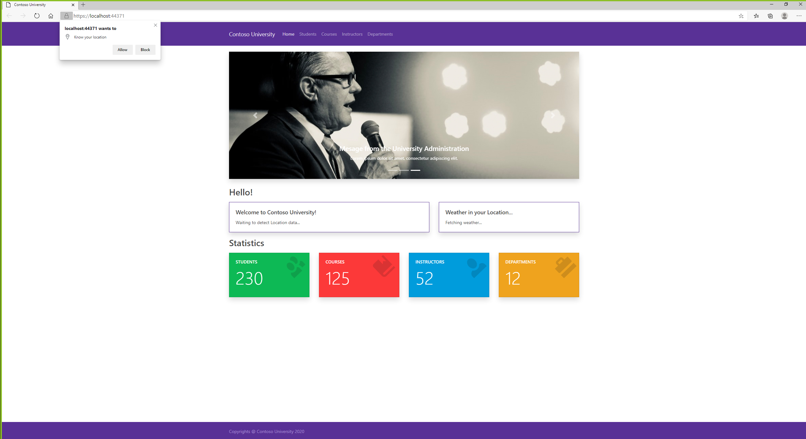
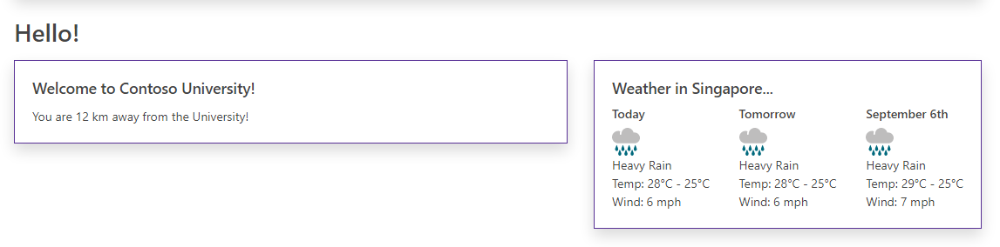

# CAPSTONE 2 - Programming in HTML5 with JavaScript and CSS3

## Day 3
Homepage with services

Same Frontend as BLOCK 1

### Implement Location API
navigator.geolocation.getCurrentPosition(getLocationSuccess, getLocationError);

### Implement Weather API
see the repo @ wwroot/scripts/ for API implementation

Code: Completed dynamic Homepage

### DYNAMIC HOMEPAGE

### DYNAMIC HOMEPAGE SERVICES
